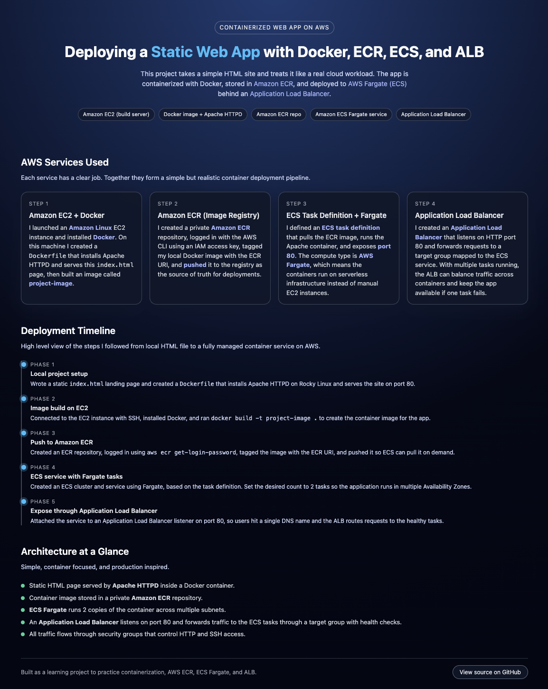

# README.md

```markdown
# AWS Containerized Web App



This project is a simple containerized web application hosted on an EC2 instance. It uses Docker to run an Apache HTTP server that serves a custom static landing page. The goal was to practice running containers on AWS, setting up an EC2 environment, and creating a reusable Docker workflow.

## Features
- Rocky Linux 8 base image
- Apache HTTP server running inside a Docker container
- Custom landing page built with HTML and inline CSS
- Port 80 exposed for public access
- Easy to build and run using a single Dockerfile

## File Structure
```

aws-containerized-webapp/
│
├── Dockerfile
├── index.html
├── screenshot-webapp.png
└── README.md

```

## How to Build Locally
1. Clone the repository.
2. Open a terminal in the project folder.
3. Build the Docker image:
```

docker build -t project-image .

```
4. Run the container:
```

docker run -d -p 80:80 --name project-container project-image

```
5. Visit:
```

[http://localhost](http://localhost)

```

## How It Works
- The Dockerfile installs Apache, copies your HTML file into the correct directory, and starts the server in the foreground.
- EC2 runs Docker, pulls the image you build, and exposes port 80 so the page is visible online.

## Files
### Dockerfile
Contains the full configuration for building the container and running Apache.

### index.html
Static landing page with simple styling, a title, and a short description.

### screenshot-webapp.png
A screenshot of the running landing page for quick reference.

## Future Improvements
- Add a form or API call for interactivity
- Add versioned deployments with ECS or ECR
- Add SSL support through HTTPS

## Author
Kamil Bisbis  
Created as a learning project for AWS, Docker, and cloud deployment basics.